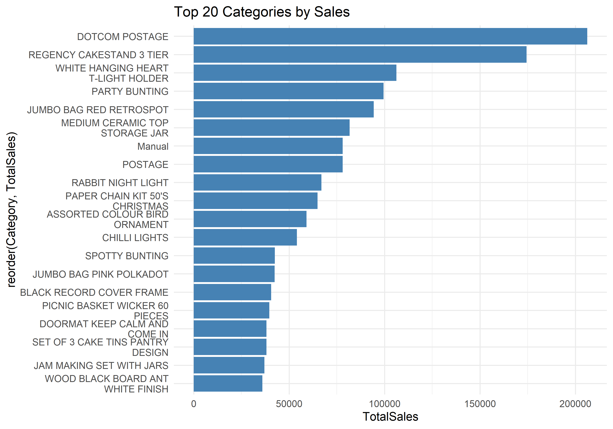
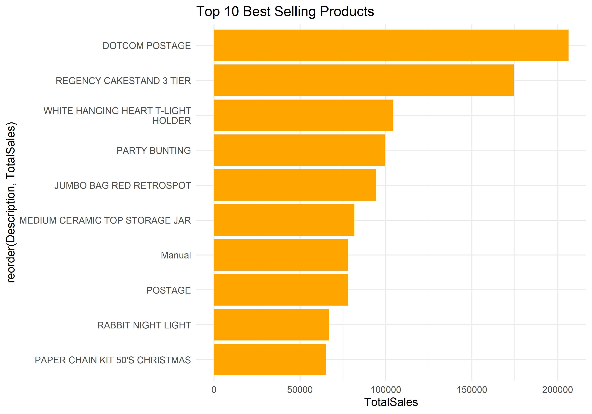
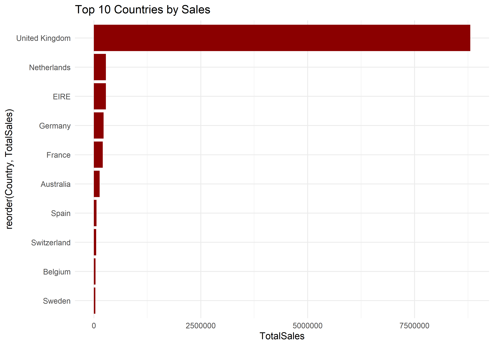
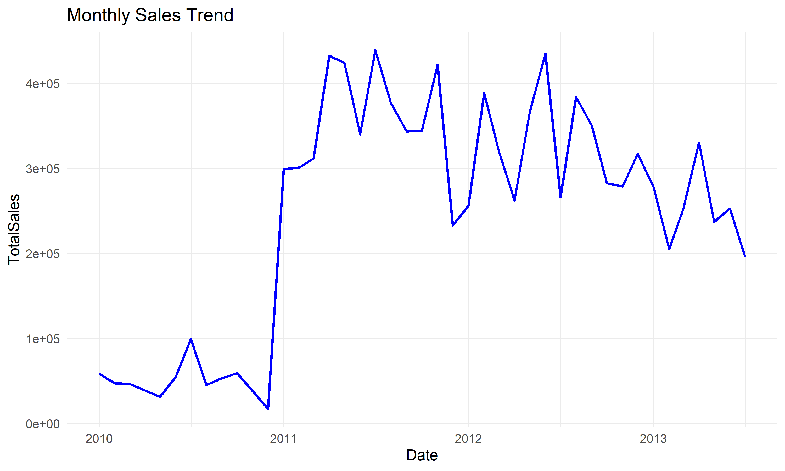
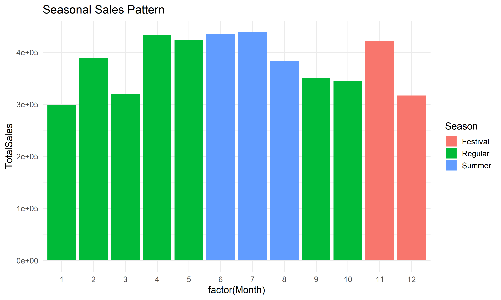
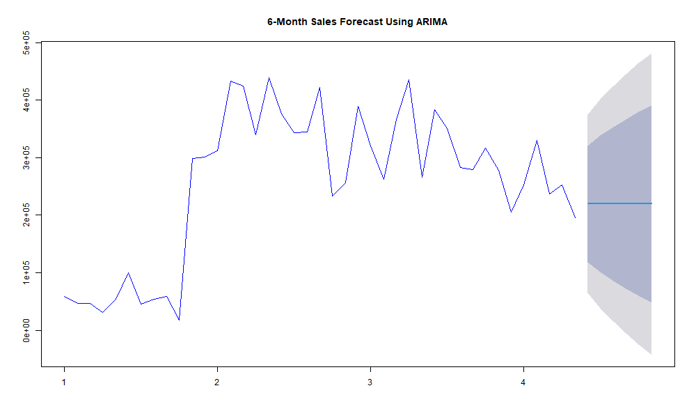

# Retail Store Inventory Analytics using Hadoop, Hive & R

An end-to-end **Big Data Analytics** project that processes and analyzes **500,000+ retail transactions** using **Hadoop HDFS**, **Apache Hive**, and **R**. The project builds a scalable analytics pipeline for inventory optimization, sales trend analysis, demand forecasting, and business intelligence.

---

## Project Overview

Retail organizations generate massive volumes of transactional data every day. This project demonstrates how distributed computing technologies can transform raw retail data into actionable business insights.

The analytics pipeline performs:

- Data ingestion into Hadoop HDFS
- Data cleaning and preprocessing using Apache Hive
- Feature engineering and aggregation
- Business analytics using SQL
- Data visualization and forecasting using R

---

## Architecture

```text
          Online Retail Dataset
                    │
                    ▼
            Hadoop HDFS Storage
                    │
                    ▼
      Apache Hive Data Processing
                    │
                    ▼
      Feature Engineering & Analytics
                    │
                    ▼
             R Visualization
                    │
                    ▼
       Business Insights & Forecasting
```

---

# Tech Stack

| Category | Technologies |
|----------|--------------|
| Big Data | Hadoop HDFS, Apache Hive |
| Language | SQL, R |
| Analytics | ggplot2, dplyr |
| Forecasting | forecast (ARIMA) |
| Visualization | corrplot, ggplot2 |

---

# Repository Structure

```text
Retail-Store-Inventory-Analysis
│
├── hive/
│     └── retail_analytics.sql
│
├── r/
│     └── retail_analytics.R
│
├── results/
│     ├── category_sales.png
│     ├── top_products.png
│     ├── monthly_sales.png
│     ├── seasonal_sales.png
│     ├── sales_forecast.png
│     ├── ...
│
├── dataset/
│
├── docs/
│
├── README.md
└── LICENSE
```

---

# Features

- Distributed data storage using Hadoop HDFS
- Data cleaning and preprocessing with Hive
- SQL-based analytical queries
- Category-wise sales analysis
- Product performance analysis
- Country-wise revenue analysis
- Seasonal demand analysis
- Weekly sales trends
- Basket size analysis
- Brand performance analysis
- Price sensitivity analysis
- Correlation analysis
- Sales forecasting using ARIMA
- Low-moving inventory detection

---

# Project Results

## Category-wise Sales



---

## Top Selling Products



---

## Store Performance



---

## Monthly Sales Trend



---

## Seasonal Sales Trend



---

## Sales Forecast



---

### Additional Results

The repository also includes additional visualizations and outputs:

- Basket Size Distribution
- Brand Performance Analysis
- Daily Sales Trend
- Weekly Sales Pattern
- Price vs Sales Analysis
- Correlation Matrix
- Low Moving Products
- Top Profit Items

These can be found in the **results/** directory.

---

# Key Insights

- Processed over **500,000 retail transactions** using a distributed analytics pipeline.
- United Kingdom accounted for the majority of total revenue.
- Home décor and gifting products generated the highest sales.
- Customer demand exhibited strong seasonal purchasing patterns.
- Sales volume was influenced more by product quantity than price.
- ARIMA forecasting identified future demand trends for inventory planning.
- Low-moving products were identified to support inventory optimization and reduce holding costs.

---

# Dataset

**Online Retail Dataset**

The dataset contains over **500,000 retail transactions**, including:

- Invoice Number
- Product Description
- Quantity
- Unit Price
- Customer ID
- Invoice Date
- Country

Dataset Source:

https://archive.ics.uci.edu/ml/datasets/online+retail

> **Note:** The dataset is not included in this repository due to licensing restrictions.

---

# Future Enhancements

- Apache Spark integration
- Interactive Power BI dashboard
- Real-time analytics using Kafka
- Airflow-based ETL automation
- Machine Learning-based demand forecasting

---

# Author

**Sujitha Madda**

msujitha1703@gmail.com

LinkedIn: https://linkedin.com/in/sujitha-madda

GitHub: https://github.com/sujitha-madda

---
